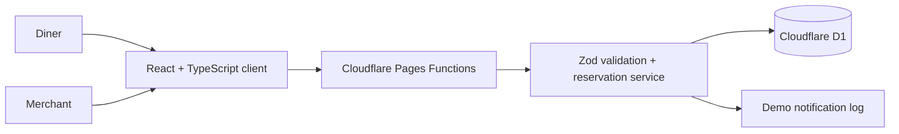

# Restaurant Page Studio Showcase

Full-stack portfolio project by **Ruiqiao Wang**, a University of Auckland
Bachelor of Science student majoring in Computer Science and Information and
Technology Management.

This public repository contains a safe, anonymous demo of a bilingual
restaurant website and merchant-confirmed reservation system. It is designed as
a recruiter-facing code sample, not as a commercial offer.

Live demo: https://restaurant-page-studio.pages.dev/

## What It Demonstrates

- Responsive bilingual restaurant pages
- Searchable visual menu with concept food imagery
- Customer reservation requests with date, time, party size and seating area
- Customer-safe reservation status links
- Protected merchant workspace for confirmation and seating assignment
- Cloudflare Pages Functions API with D1 persistence
- Runtime validation with Zod and automated tests with Vitest
- Demo notification mode that records notification attempts without sending
  real email or SMS

Online ordering, shopping carts, table QR ordering and payment collection are
intentionally out of scope.

## Architecture



## Public Demo Routes

- `/` - English-first portfolio homepage with Chinese toggle
- `/resume` - web resume
- `/p/shu-xiang` - anonymous restaurant concept
- `/p/shu-xiang/menu` - read-only bilingual visual menu
- `/p/shu-xiang/reserve` - reservation request form
- `/reservation/:statusToken` - customer-safe reservation status
- `/counter/login` - merchant login demo
- `/counter/reservations` - protected merchant reservation workspace
- `/studio` - local generator, unavailable in production

## Local Development

```bash
npm ci
npm run dev
npm test
npm run build
```

Cloudflare local development uses the example Wrangler file:

```bash
cp wrangler.example.toml wrangler.local.toml
npm run auth:generate -- "temporary-owner-password" "2468" "owner@example.com"
# Store generated values in .dev.vars
npm run db:migrate:local
npm run dev:cloudflare
```

`.dev.vars`, local D1 state and production credentials must never be committed.

## Privacy Boundary

This public version includes only anonymous demonstration data and original
concept imagery. It does not include private source files, commercial contact
drafts, real restaurant contact details, production D1 bindings, environment
secrets, banking details or personal CV files.

## AI Use Statement

This project was built with AI-assisted development. Ruiqiao Wang remained
responsible for product direction, architecture choices, code review,
debugging, automated tests, privacy boundaries and final implementation
decisions.
